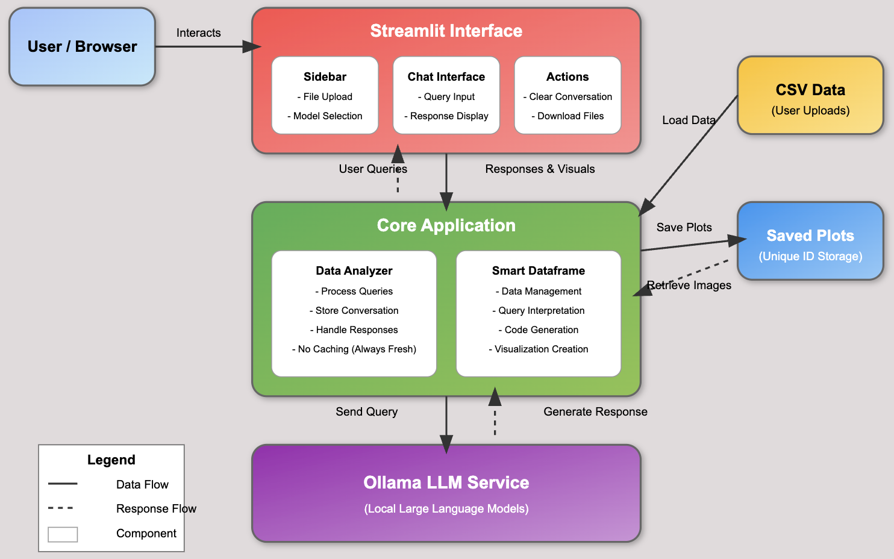

# AI Data Analyst

A Streamlit application that enables natural language analysis of CSV data using PandasAI, LangChain, and Ollama.



## Features

- **Natural Language Data Analysis**: Ask questions about your data in plain English
- **Visualization Generation**: Create charts and graphs with simple text prompts
- **Code Transparency**: View the Python code used to answer each question
- **Local LLM Integration**: Powered by Ollama for privacy and control
- **No Caching**: Every query is processed freshly by the LLM
- **Conversation History**: Track your analysis journey with a full conversation log
- **Exportable Results**: Download your data and conversation history

## Installation

### Prerequisites

- Python 3.9 or higher
- [Ollama](https://ollama.com/download) installed and running on your system
- At least one LLM model pulled in Ollama (e.g., mixtral, llama3)

### Setup

1. Clone this repository:
   ```bash
   git clone https://github.com/iRahulPandey/TTYD.git
   cd TTYD
   ```

2. Create a virtual environment (optional but recommended):
   ```bash
   python -m venv venv
   source venv/bin/activate  # On Windows: venv\Scripts\activate
   ```

3. Install the required dependencies:
   ```bash
   pip install -r requirements.txt
   ```

4. Make sure Ollama is running:
   ```bash
   ollama serve
   ```

5. Pull at least one model (if you haven't already):
   ```bash
   ollama pull mixtral  # or llama3, gemma, etc.
   ```

## Usage

1. Start the application:
   ```bash
   streamlit run main.py
   ```

2. Open your web browser and navigate to the URL shown in the terminal (typically `http://localhost:8501`)

3. Upload a CSV file using the sidebar uploader

4. Select an LLM model from the dropdown (must be installed in Ollama)

5. Start asking questions about your data!

### Example Questions

- "How many rows are in this dataset?"
- "What are the column names?"
- "Show me a summary of the numerical columns"
- "Create a bar chart of the top 5 values in Category"
- "Show the distribution of values in CustomerAge"
- "Calculate the correlation between Price and Rating"
- "Find any missing values in the dataset"
- "Show me a trend of sales by month"
- "What is the average order value by category?"
- "Create a pie chart showing payment methods"

### Actions

- **Clear Conversation**: Removes the current conversation history
- **Download Data as CSV**: Download the currently loaded dataset
- **Download Conversation**: Save the entire conversation history as a text file

## Project Structure

```
ttyd/
├── __init__.py
├── main.py              # Application entry point
├── config.py            # Configuration settings
├── ui/
│   ├── __init__.py
│   ├── app.py           # Main Streamlit UI
│   ├── components.py    # Reusable UI components
│   └── styles.py        # CSS and styling
├── core/
│   ├── __init__.py
│   ├── analysis.py      # Analysis functionality
│   ├── dataframe.py     # SmartDataframe management
│   └── llm.py           # LLM integration
└── utils/
    ├── __init__.py
    ├── data_loader.py   # Data loading utilities
    ├── image_handler.py # Image processing utilities
    └── models.py        # Model management utilities
```

## Dependencies

- streamlit: Web application framework
- pandasai: Natural language interface for pandas
- langchain: Framework for LLM applications
- pandas: Data manipulation and analysis
- plotly: Interactive visualizations
- ollama: Local LLM inference

## Troubleshooting

### Common Issues

1. **"No module named 'ttyd'"**
   - Make sure you're running the application from the project root directory
   - If using a package structure, install in development mode: `pip install -e .`

2. **"No Ollama models found"**
   - Ensure Ollama is running with `ollama serve`
   - Pull at least one model with `ollama pull mixtral`

3. **Visualization Issues**
   - If visualizations don't appear correctly, check that plotly is installed
   - Ensure your data is appropriate for the requested visualization type

4. **Performance Considerations**
   - Since caching is disabled, every query requires LLM processing
   - For larger datasets, complex queries may take longer to process
   - Performance depends on the speed of your local LLM (CPU/GPU availability)